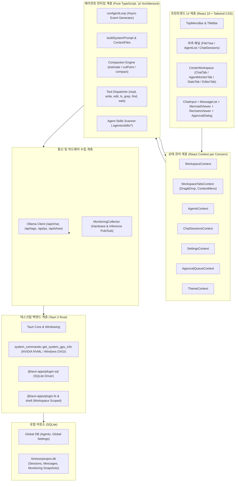

# Fortress 시스템 아키텍처 및 재구현 가이드 (Reimplementation Blueprint)

> **문서 버전**: 1.0.0  
> **최종 갱신**: 2026-09-22  
> **대상 독자**: Fortress를 처음 파악하려는 엔지니어, 현재 코드를 기반으로 새로운 로컬 AI 에이전트 애플리케이션을 제작하려는 개발자 및 AI 코딩 에이전트.

---

## 1. 프로젝트 개요 및 핵심 철학

**Fortress**는 로컬 데스크탑 환경에서 완전한 프라이버시를 보장하며 동작하는 **Ollama 기반 로컬 AI 에이전트 워크스테이션**입니다. 문서 작성, 코드베이스 탐색 및 편집, 비즈니스 로직 작성, 실시간 차트/다이어그램 시각화, 그리고 하드웨어 자원 모니터링을 단일 데스크탑 앱에서 통합 제공합니다.

### 1.1 핵심 설계 철학
1. **Zero-Framework Overhead (No LangChain / No LlamaIndex)**
   - LangChain, LangGraph 등의 외부 에이전트 프레임워크를 사용하지 않고, 경량 에이전트 런타임 **`pi`([earendil-works/pi](https://github.com/earendil-works/pi))의 순수 TypeScript 루프 패턴**을 채택했습니다.
   - Ollama의 네이티브 HTTP API(`/api/chat`, `/api/tags`, `/api/ps`, `/api/show`)와 직접 통신하여 오버헤드를 없애고 디버깅 투명성을 100% 확보했습니다.
2. **Local-First & Append-Only Storage**
   - 네트워크 연결 없이 동작하며, 모든 대화, 도구 실행 기록, 에이전트 메트릭, 하드웨어 스냅샷은 SQLite에 이벤트 소싱(Append-Only) 방식으로 저장됩니다.
   - 워크스페이스별로 독립된 `.fortress/project.db`가 자동 생성되어 프로젝트 간 데이터가 완전히 격리됩니다.
3. **Strict Security & HITL (Human-in-the-Loop)**
   - 파일 쓰기(`write`), 편집(`edit`), 셸 실행 등 위험 도구는 사용자의 사전 승인을 강제하는 보안 계층을 내장합니다.
4. **Context Budgeting & Compaction**
   - 로컬 모델의 컨텍스트 한계(8k~64k)를 극복하기 위해 `reserveTokens` 임계치 기반 자동 요약 및 슬라이딩 윈도우 압축 엔진을 내장합니다.
5. **Real-time Visualization & Observability**
   - 에이전트가 생성한 Mermaid 다이어그램 및 Recharts 데이터 블록을 실시간으로 감지하여 대화창 내에서 렌더링합니다.
   - GPU 사용량, VRAM 점유율, KV 캐시, 추론 속도(tokens/sec)를 실시간 시계열 그래프로 모니터링합니다.

---

## 2. 현재까지의 구현 현황 (Implementation Status)

Fortress는 Phase 0부터 Phase 7까지 계획된 모든 기능의 구현 및 검증을 완료했습니다 (총 42개 테스트 파일, 188개 테스트 100% 통과).

| 단계 (Phase) | 명칭 | 핵심 구현 내용 | 주요 소유 모듈 |
| :--- | :--- | :--- | :--- |
| **Phase 0** | Foundation | Tauri 2 + React 19 + TypeScript + Tailwind CSS v3 스택 구성, SQLite 플러그인 연동, Ollama HTTP 클라이언트 | `src-tauri/`, `src/lib/llm/`, `src/lib/db/` |
| **Phase 1** | Shell & Layout | VivoStudio 풍 3패널 반응형 레이아웃(`react-resizable-panels`), 커스텀 타이틀바, 시스템 리소스 위젯, 다크/라이트 테마 | `src/components/layout/`, `src/components/explorer/` |
| **Phase 2** | Agent Runtime | 순수 TS 자율 루프(`loop.ts`), 8대 도구 세트(`read`, `write`, `edit`, `ls`, `grep`, `find`, `web_search`, `web_fetch`), 컨텍스트 슬라이딩 압축(`compact.ts`) | `src/lib/agent/`, `src/lib/tools/`, `src/lib/compaction/` |
| **Phase 3** | Skills & Context | Agent Skills 오픈 표준(.agents/skills/*/SKILL.md) 파서, 프로그레시브 디스클로저, 계층별 `AGENTS.md` 로더, 스킬 인보커 | `src/lib/skills/`, `src/lib/prompt/` |
| **Phase 4** | Session Storage | SQLite 기반 세션 및 메시지 이벤트 영속화, 프로젝트별 격리 DB (`.fortress/project.db`) 자동 초기화 및 마이그레이션 | `src/lib/db/repositories/`, `src/components/chatsessions/` |
| **Phase 5** | Visualization & HITL | 실시간 스트리밍 대화창, 도구 실행 블록, Mermaid 다이어그램 실시간 렌더링, Recharts 인터랙티브 차트, 도구 승인 다이얼로그(`ApprovalDialog.tsx`) | `src/components/chat/`, `src/lib/markdown/` |
| **Phase 6** | Agent Management | 에이전트 다중 프로필 CRUD, 시스템 프롬프트 및 도구 커스터마이징, 에이전트 통계 탭, GPU/VRAM 실시간 모니터링 대시보드 | `src/components/agents/`, `src/components/workspace/` |
| **Phase 7** | Multi-Tab & Polish | 드래그 앤 드롭 탭 재정렬, 탭 컨텍스트 메뉴(우측/좌측/다른 탭 닫기), 파일 탐색기 CRUD(생성/삭제/이름변경), 단축키, 에러 바운더리 | `src/lib/context/WorkspaceTabsContext.tsx`, `CenterWorkspace.tsx` |

---

## 3. 전체 시스템 아키텍처

### 3.1 계층별 아키텍처 다이어그램



### 3.2 런타임 데이터 흐름 (Runtime Flow)
1. **사용자 입력 접수**: `ChatInput`에서 메시지 입력 및 전송.
2. **컨텍스트 조합 (`buildSystemPrompt`)**:
   - 베이스 시스템 프롬프트 + 에이전트 커스텀 지침
   - 워크스페이스 `AGENTS.md` (루트 및 서브폴더) 스캔 결과
   - 사용 가능한 스킬 메타데이터 목록 (프로그레시브 디스클로저)
3. **토큰 예산 평가 및 자동 압축 (`Compaction Engine`)**:
   - 현재 메시지 누적 토큰이 `contextSize - reserveTokens`를 초과하면 오래된 턴을 자동으로 요약(Summary)하고 컷포인트를 계산하여 압축.
4. **Ollama 스트리밍 호출 (`ollamaClient.streamChat`)**:
   - OpenAI 호환 규격의 도구 정의(`tools`)와 함께 Ollama `/api/chat`에 스트리밍 요청.
   - 텍스트 청크, 사고 과정(`<think>` 또는 `thinking`), 도구 호출(`tool_calls`)을 실시간 수신.
5. **사고 과정 처리 및 정지 방지 (Thinking-Only Recovery)**:
   - Qwen 3.5 등의 모델이 도구 호출이나 답변 없이 사고 과정만 출력하고 멈추는 경우, 런타임이 즉시 보조 프롬프트를 주입하여 자율 복구.
6. **도구 승인 검사 (HITL Approval)**:
   - `write`, `edit` 등 상태 변경 도구 호출 감지 시 `beforeToolCall` 훅이 트리거되어 사용자에게 승인 다이얼로그 표시.
7. **도구 실행 및 결과 반영**:
   - 도구 실행 결과를 `role: 'tool'` 메시지로 대화 이력에 추가하고 다음 턴 스트리밍 재개.
8. **이벤트 소싱 영속화**:
   - 모든 턴과 도구 호출 결과는 비동기로 SQLite `.fortress/project.db`의 `chat_messages` 테이블에 기록.

---

## 4. 코드베이스 디렉터리 및 핵심 파일 구성

```
Fortress/
├── src-tauri/                      # Tauri 2 Rust 백엔드
│   ├── src/
│   │   ├── commands/
│   │   │   └── system_commands.rs  # GPU/VRAM/RAM 메트릭 수집 네이티브 커맨드
│   │   ├── lib.rs                  # Tauri 플러그인 등록 및 핸들러 바인딩
│   │   └── main.rs                 # 앱 엔트리포인트
│   ├── Cargo.toml
│   └── tauri.conf.json             # 창 크기, 보안 스코프, 타이틀바 설정
│
├── src/                            # React 19 프런트엔드
│   ├── components/                 # UI 컴포넌트
│   │   ├── agents/                 # 에이전트 카드, 목록, 편집 폼, 통계 패널
│   │   │   ├── AgentCard.tsx
│   │   │   ├── AgentEditorForm.tsx
│   │   │   ├── AgentListPanel.tsx
│   │   │   └── AgentStatsPanel.tsx
│   │   ├── chat/                   # 채팅 대화창 및 시각화 컴포넌트
│   │   │   ├── ApprovalDialog.tsx  # 도구 실행 승인 모달
│   │   │   ├── ChatInput.tsx       # 자동 높이 조절 입력창 & 단축키
│   │   │   ├── CompactionBanner.tsx# 컨텍스트 압축 알림 배너
│   │   │   ├── MermaidViewer.tsx   # Mermaid 다이어그램 동적 렌더러
│   │   │   ├── RechartsViewer.tsx  # Recharts 인터랙티브 차트 렌더러
│   │   │   └── ToolCallCard.tsx    # 도구 호출 및 결과 카드
│   │   ├── chatsessions/           # 세션 이력 목록 및 관리
│   │   │   └── ChatSessionList.tsx
│   │   ├── explorer/               # 파일 트리 및 파일 CRUD 탐색기
│   │   │   └── FileTree.tsx
│   │   ├── layout/                 # 앱 전체 프레임 및 타이틀바
│   │   │   ├── CustomTitleBar.tsx  # 윈도우 컨트롤(최소화/최대화/닫기)
│   │   │   ├── SystemResourceWidget.tsx # 상단 GPU/CPU 위젯
│   │   │   └── TopMenuBar.tsx      # 상단 메뉴바 (단축키 지원)
│   │   └── workspace/              # 중앙 작업공간 탭 컴포넌트
│   │       ├── AgentEditorTab.tsx  # 에이전트 설정 편집 탭
│   │       ├── AgentMonitorTab.tsx # 실시간 GPU/토큰 모니터링 대시보드
│   │       ├── AgentStatsTab.tsx   # 누적 에이전트 통계 탭
│   │       ├── CenterWorkspace.tsx # 탭 헤더(드래그 앤 드롭, 컨텍스트 메뉴)
│   │       └── ChatTab.tsx         # 대화 및 스트리밍 메인 탭
│   │
│   ├── lib/                        # 비즈니스 로직 및 런타임 라이브러리
│   │   ├── agent/                  # 에이전트 코어 루프
│   │   │   ├── hooks.ts            # Approval & 이벤트 수신 훅
│   │   │   └── loop.ts             # 핵심 자율 에이전트 실행 루프
│   │   ├── approval/               # 승인 정책 및 큐 관리
│   │   ├── compaction/             # 토큰 계산 및 대화 압축 알고리즘
│   │   │   ├── compact.ts          # 요약 프롬프트 및 압축 실행기
│   │   │   ├── cutPoint.ts         # 슬라이딩 컷포인트 분할 알고리즘
│   │   │   └── estimate.ts         # 빠른 토큰 어림치 계산기
│   │   ├── context/                # React Context 프로바이더들
│   │   │   ├── AgentsContext.tsx
│   │   │   ├── ChatSessionsContext.tsx
│   │   │   ├── WorkspaceContext.tsx
│   │   │   └── WorkspaceTabsContext.tsx # 다중 탭 및 드래그 앤 드롭 상태
│   │   ├── db/                     # SQLite 데이터베이스 클라이언트 및 리포지토리
│   │   │   ├── client.ts           # DB 초기화 및 마이그레이션 DDL
│   │   │   └── repositories/
│   │   │       ├── agentsRepo.ts
│   │   │       ├── logsRepo.ts
│   │   │       ├── monitoringRepo.ts # 모니터링 스냅샷 저장소
│   │   │       └── sessionsRepo.ts
│   │   ├── llm/                    # Ollama 통신 인터페이스
│   │   │   ├── messageMapper.ts    # 메시지 포맷 변환 및 클린업
│   │   │   └── ollamaClient.ts     # HTTP API (/api/chat, /api/ps, /api/show)
│   │   ├── markdown/               # Mermaid & Recharts 코드 블록 파서
│   │   ├── monitoring/             # 실시간 하드웨어 & 추론 메트릭 수집기
│   │   │   └── monitoringCollector.ts # 백그라운드 폴러 및 이벤트 버스
│   │   ├── prompt/                 # 시스템 프롬프트 조립기
│   │   ├── skills/                 # Agent Skills (.agents/skills) 로더
│   │   └── tools/                  # 기본 8개 도구 구현체
│   │       ├── edit.ts, find.ts, grep.ts, ls.ts, read.ts, write.ts
│   │       └── webSearch.ts, webFetch.ts
│   │
│   ├── pages/
│   │   └── Workspace.tsx           # 3패널 통합 워크스페이스 뷰
│   ├── App.tsx                     # 전역 프로바이더 설정 및 HashRouter
│   └── main.tsx                    # React 진입점
│
├── Docs/                           # 설계, 구현, 벤치마크 분석 문서
└── package.json
```

---

## 5. 핵심 기술적 결정과 구현 노하우

### 5.1 왜 HashRouter인가?
Tauri 데스크탑 앱은 내부적으로 `tauri://localhost` 또는 커스텀 프로토콜을 통해 번들된 정적 파일(`index.html`)을 제공합니다. 일반적인 웹 서버와 달리 브라우저의 SPA Fallback(존재하지 않는 서브 패스 요청 시 `index.html`을 서빙하는 동작)이 동작하지 않으므로, `BrowserRouter`를 사용하면 새로고침이나 서브 경로 이동 시 **빈 흰색 화면(Whiteout)**이 발생합니다. 따라서 데스크탑 앱 환경에서는 반드시 **`HashRouter`**를 사용해야 합니다.

### 5.2 Ollama Tool Calling 연동의 모델별 차이점 및 대응
- 최신 로컬 모델(Qwen 2.5, Qwen 3.5, Llama 3.1)은 Ollama의 `tools` 매개변수와 호환되어 `tool_calls` 객체를 직접 반환합니다.
- 그러나 일부 양자화 모델이나 프롬프트 지시 과정에서 다음과 같은 이상 징후가 발생할 수 있습니다:
  1. **Thinking-Only Halting**: 모델이 `<think>` 태그 내에서 사고만 길게 작성하고 정작 도구 호출 JSON을 생성하지 않은 채 응답을 종료하는 현상.
     - **해결책**: `loop.ts`에서 `assistantThinking`만 존재하고 도구 호출과 본문이 없는 경우를 감지하여 최대 2회까지 시스템 안내 프롬프트를 즉시 재주입하여 도구 실행을 강제합니다.
  2. **추론 태그 누출**: 답변 본문에 `<thought>` 또는 `<think>` 블록이 잔존하여 사용자 UI에 노출되는 문제.
     - **해결책**: `cleanThinkingText()` 정규식을 거쳐 불필요한 사고 스크래치패드를 분리 및 정제합니다.

### 5.3 GQA 모델(Qwen 3.5 등)의 KV 캐시 최적화 및 VRAM 가이드
RTX 4070 SUPER(12GB VRAM) 환경에서 측정한 실측 데이터 분석 결과(`Docs/MonitoringAnalysis_Qwen3.5_8k.md`, `64k.md`):
- Qwen 3.5 (9B) 모델은 **GQA (Grouped-Query Attention, 8 KV Heads)**를 채택하여 1토큰당 KV 캐시 소모량이 약 **131 KB**에 불과합니다.
- 따라서 **32k(32,768 토큰)** 설정 시에도 KV 캐시 점유는 약 **1.05 GB**에 불과하며, 6.6GB의 모델 가중치와 합쳐도 총 VRAM은 9.65GB로 12GB 그래픽카드에서 **100% Full GPU 가속(디코딩 60~70 tokens/s)**이 유지됩니다.
- **권장 설정**:
  * 일반 작업: 컨텍스트 32,768 / `reserveTokens` 4,096 / `keepRecentTokens` 4,096
  * 대용량 분석: 컨텍스트 65,536 / `reserveTokens` 8,192 / `keepRecentTokens` 8,192

### 5.4 네이티브 하드웨어 수집 (Tauri Rust vs Web API)
웹 브라우저의 JS 샌드박스에서는 GPU 온도나 실시간 VRAM 점유율을 알 수 없습니다. Fortress는 Tauri의 Rust 백엔드에 `get_system_gpu_info` 커맨드를 구현하여 `nvml-wrapper` 또는 Windows 시스템 API를 직접 호출하고, 이를 프런트엔드의 `monitoringCollector.ts`가 1~2초 간격으로 폴링하여 실시간 차트를 구성합니다.

---

## 6. 앱 재구현을 위한 단계별 가이드 (Step-by-Step Blueprint)

현재 앱을 바탕으로 새로운 유사 앱을 제작하거나 밑바닥부터 다시 구현할 경우 다음 순서로 진행하는 것을 권장합니다:

### 1단계: 프로젝트 스캐폴딩 및 Tauri 2 기본 설정
```bash
# Vite + React + TypeScript 생성
pnpm create vite my-agent-app --template react-ts
cd my-agent-app

# Tailwind CSS v3, lucide-react, react-resizable-panels, recharts, mermaid 설치
pnpm add lucide-react react-resizable-panels recharts mermaid clsx tailwind-merge
pnpm add @uiw/react-codemirror @codemirror/lang-markdown zod

# Tauri 2 CLI 및 플러그인 설치
pnpm add -D @tauri-apps/cli
pnpm add @tauri-apps/api @tauri-apps/plugin-sql @tauri-apps/plugin-fs @tauri-apps/plugin-shell
pnpm tauri init
```

### 2단계: Ollama 통신 계층 작성 (`src/lib/llm/ollamaClient.ts`)
- Ollama `fetch` 스트리밍 엔드포인트(`http://127.0.0.1:11434/api/chat`)를 작성합니다.
- `ReadableStream`의 UTF-8 디코더와 NDJSON 파서를 결합하여 실시간 청크 단위 콜백(`onChunk`)을 지원합니다.
- `/api/tags` (설치된 모델 목록), `/api/ps` (실행 중인 모델 정보), `/api/show` (모델 세부 사양) 조회 함수를 추가합니다.

### 3단계: 순수 TypeScript 에이전트 루프 구축 (`src/lib/agent/loop.ts`)
- 외부 오케스트레이션 라이브러리를 배제하고, `while (hasFollowUp && !signal.aborted)` 형태의 턴 루프를 작성합니다.
- 턴 내부 흐름:
  1. `streamChat` 호출 및 청크 누적
  2. 도구 호출 파싱 (`tool_calls`)
  3. 승인 훅 (`beforeToolCall`) 호출
  4. 도구 디스패처를 통한 실행 및 결과 생성
  5. `role: 'tool'` 메시지 추가 후 다음 턴 반복
  6. 도구 호출이 없으면 최종 사용자 응답 완료로 루프 종료

### 4단계: 도구 샌드박스 및 보안 승인 계층 (`src/lib/tools/`)
- 도구들은 기본적으로 워크스페이스 루트 경로를 벗어날 수 없도록 경로 정규화(`resolvePath`) 검증을 거칩니다.
- `read`, `write`, `edit`, `ls`, `grep`, `find`, `web_search`, `web_fetch` 도구를 Zod 스키마와 함께 선언합니다.
- `write`, `edit` 등 파일 수정 도구는 React `ApprovalQueueContext`에 승인 요청을 발행하고 사용자가 UI에서 "승인"을 누를 때까지 비동기 대기(`Promise`)합니다.

### 5단계: SQLite 로컬 영속화 계층 (`src/lib/db/`)
- `@tauri-apps/plugin-sql`을 사용하여 SQLite 데이터베이스를 초기화합니다.
- `chat_sessions`, `chat_messages`, `agents`, `agent_monitoring_snapshots` 테이블을 생성하는 마이그레이션 스크립트를 작성합니다.
- 대화 내역은 덮어쓰지 않고 `turn_index` 순서대로 Append-Only 저장합니다.

### 6단계: 시각화 및 멀티 탭 UI 통합 (`src/components/`)
- `MermaidViewer`: 에이전트가 출력한 ` ```mermaid ` 블록을 감지하여 `mermaid.render()`로 SVG를 생성하고 줌/패닝 기능을 제공합니다.
- `RechartsViewer`: 에이전트가 출력한 ` ```json:chart ` 블록을 감지하여 인터랙티브 Line, Bar, Pie 차트로 전환합니다.
- `WorkspaceTabsContext`: 대화창, 에이전트 편집기, 모니터링 대시보드를 독립된 탭으로 열고 닫을 수 있는 다중 탭 시스템을 구현합니다.

---

## 7. 핵심 인터페이스 및 데이터 모델 명세

### 7.1 에이전트 설정 모델 (`AgentConfig`)
```typescript
export interface AgentConfig {
  id: string;                      // 고유 ID (예: 'default-agent-fortress')
  name: string;                    // 표시 이름
  model: string;                   // Ollama 모델명 (예: 'qwen3.5:9b')
  systemPrompt: string;            // 사용자 정의 지침
  temperature: number;             // 기본값 0.7
  contextSize: number;             // 기본값 8192 또는 32768
  reserveTokens: number;           // 압축 발동 여유 토큰 (예: 4096)
  keepRecentTokens: number;        // 압축 시 유지할 최근 토큰 (예: 4096)
  enabledTools: string[];          // 활성화된 도구 목록
  enabledSkills: string[];         // 활성화된 스킬 목록
  approvalMode: 'always' | 'auto_read' | 'danger_only' | 'yolo';
}
```

### 7.2 대화 메시지 모델 (`AgentMessage`)
```typescript
export interface AgentMessage {
  role: 'system' | 'user' | 'assistant' | 'tool';
  content: string;
  thinking?: string;               // 모델 추론 과정
  toolCalls?: Array<{
    id: string;
    name: string;
    arguments: Record<string, unknown>;
  }>;
  toolCallId?: string;             // role === 'tool'일 때 참조하는 도구 호출 ID
  stopReason?: 'stop' | 'toolUse' | 'maxTokens' | 'abort' | 'error';
  usage?: {
    promptTokens: number;
    completionTokens: number;
    totalTokens: number;
  };
}
```

### 7.3 모니터링 스냅샷 모델 (`AgentMonitoringSnapshot`)
```typescript
export interface AgentMonitoringSnapshot {
  id?: number;
  sessionId: string;
  agentId: string;
  timestamp: string;               // ISO 8601
  turnIndex: number;
  contextUsageRatio: number;       // 현재 사용 토큰 / contextSize
  totalPromptTokens: number;
  totalCompletionTokens: number;
  tokensPerSecond: number;         // 디코딩 속도
  systemGpuMemoryUsedMb: number;   // VRAM 점유량 (MB)
  systemGpuMemoryTotalMb: number;  // 총 VRAM (MB)
  gpuOffloadRatio: number;         // GPU 레이어 오프로딩 비율 (%)
  modelWeightsVramMb: number;      // 모델 가중치 점유 (MB)
  kvCacheVramMb: number;           // 추정 KV 캐시 점유 (MB)
  gpuTemperatureCelsius?: number;  // GPU 온도
}
```

---

## 8. 문서 및 참고 자료 링크

Fortress 프로젝트의 상세 설계와 부가 정보는 `Docs/` 내 다음 문서들에서 확인하실 수 있습니다:

- **[Architecture.md](./Architecture.md)**: 데이터 모델, 계층 구조, 런타임 수명 주기의 원본 아키텍처 설계서 (단일 진실 공급원)
- **[UserGuide.md](./UserGuide.md)**: 일반 사용자를 위한 화면별 기능 설명 및 단축키 안내
- **[MonitoringAnalysis_Qwen3.5_8k.md](./MonitoringAnalysis_Qwen3.5_8k.md)**: 8k 컨텍스트 환경 실측 데이터 분석 및 한계 진단
- **[MonitoringAnalysis_Qwen3.5_64k.md](./MonitoringAnalysis_Qwen3.5_64k.md)**: 64k 컨텍스트 환경 실측 벤치마크 및 종합 연구 리포트
- **[ImplementationPlan.md](./ImplementationPlan.md)**: 8단계(Phase 0~7) 구현 로드맵 및 의존성 그래프
- **[TODO.md](./TODO.md)**: 완료된 작업 내역 및 과거 이슈 로그
- **[QA-Checklist.md](./QA-Checklist.md)**: 릴리스 전 기능 검증 체크리스트
- **[AGENTS.md](../AGENTS.md)**: AI 코딩 에이전트 개발 협업 및 코드 작성 규칙
