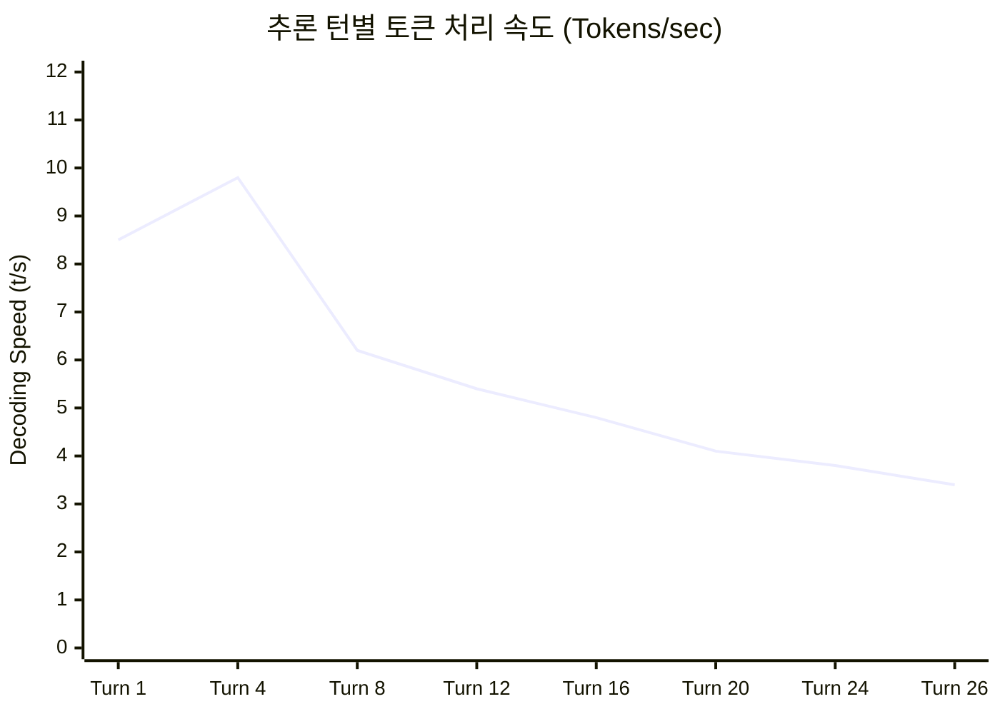
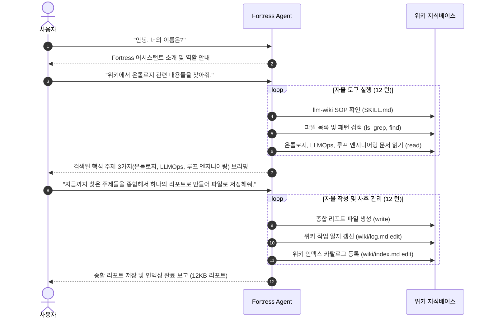
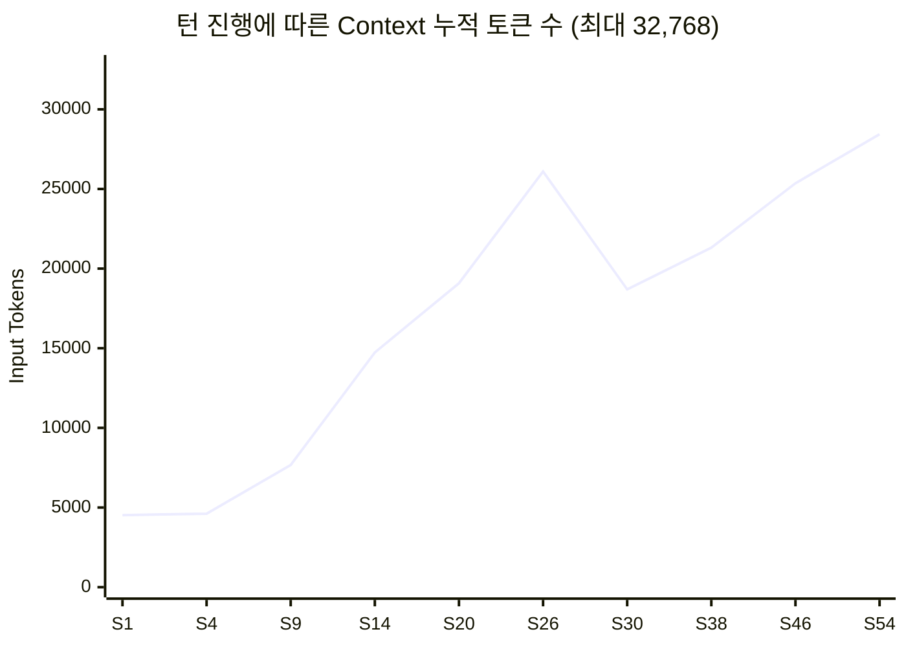

# 🛡️ Fortress 에이전트 대화 및 실시간 모니터링 로그 분석 리포트

- **대상 에이전트**: `Qwen3.8 27B 32k` (`agent_1790301235727_0gfsc`)
- **실제 로드 모델**: `qwen3.5:9b` (Qwen 3.5 9.7B Architecture)
- **세션 ID**: `62ffe297-4e75-41bb-8ce5-6c3868a860a8`
- **모니터링 기간**: 2026-09-25 10:54:07 ~ 11:54:13 KST (총 1시간 00분 06초)
- **수집된 모니터링 스냅샷**: 총 471개

---

## 1. 하드웨어 환경 및 에이전트 구성 요약

### 1.1 하드웨어 스펙
| 항목 | 사양 / 측정값 | 비고 |
| :--- | :--- | :--- |
| **GPU** | NVIDIA GeForce RTX 4070 SUPER | 12 GB VRAM |
| **Total VRAM** | 12,282 MB (~12.0 GB) | GDDR6X |
| **System RAM** | 31,911 MB (~32.0 GB) | 시스템 호스트 메모리 |

### 1.2 에이전트 및 모델 파라미터
| 항목 | 설정값 | 비고 |
| :--- | :--- | :--- |
| **에이전트 이름** | `Qwen3.8 27B 32k` | UI 표시 명칭 |
| **Ollama 모델 태그** | `qwen3.5:9b` (파라미터: 9.7B) | Qwen 3.5 기반 |
| **Context Window** | **32,768 토큰** (32k) | 설정된 컨텍스트 제한 |
| **Reserve Tokens** | 8,192 토큰 | 압축(Compaction) 유보 영역 |
| **Keep Recent Tokens**| 8,192 토큰 | 압축 시 보존할 최근 컨텍스트 |
| **온도 (Temperature)** | 0.7 | 기본 샘플링 값 |
| **활성화된 스킬** | `llm-wiki` | 지식베이스 관리 SOP |
| **활성화된 도구** | `read`, `write`, `edit`, `ls`, `grep`, `find`, `web_search`, `web_fetch` | 8종 내장 도구 |
| **승인 모드** | `dangerous-only` | 위험 명령만 사전 승인 |

> [!NOTE]
> 에이전트 이름은 "Qwen3.8 27B 32k"로 지정되었으나, 실제 백엔드 Ollama에서 구동된 모델은 `qwen3.5:9b` (9.7B 파라미터)였습니다.

---

## 2. 하드웨어 리소스 및 추론 성능 분석

471개의 실시간 시계열 모니터링 스냅샷을 기반으로 집계된 하드웨어 및 추론 지표 통계입니다.

### 2.1 리소스 사용량 통계

| 측정 지표 | 최소값 (Min) | 평균값 (Avg) | 최대값 (Max) | 상태 평가 |
| :--- | :---: | :---: | :---: | :--- |
| **GPU 사용률 (%)** | 0.0 % | **35.77 %** | **100.0 %** | 활성 추론 시 풀로드 활용 |
| **VRAM 사용량 (MB)** | 1,366 MB | **11,001.9 MB** (10.74 GB) | **11,440 MB** (11.17 GB) | **VRAM 상한(93.1%) 근접** |
| **GPU 온도 (°C)** | 38.0 °C | **45.54 °C** | **68.0 °C** | 매우 안정적인 쿨링 상태 유지 |
| **가용 시스템 RAM (MB)**| 496 MB | **3,675.2 MB** | 20,527 MB | 피크 시 시스템 메모리 압박 발생 |

### 2.2 Ollama 추론 속도 및 지연 시간 (Inference Latency)

총 26회의 모델 추론 사이클에 대한 속도 통계입니다.

| 지표 | 최소 (Min) | 평균 (Avg) | 최대 (Max) | 분석 코멘트 |
| :--- | :---: | :---: | :---: | :--- |
| **Prefill (Prompt) 속도** | 506.8 t/s | **6,457.19 t/s** | 16,438.3 t/s | KV 캐시 재사용으로 매우 우수한 프롬프트 처리 |
| **Decoding (생성) 속도** | 3.4 t/s | **5.27 t/s** | 9.8 t/s | 컨텍스트 증가 및 VRAM 포화에 따라 후반부 저하 |
| **단일 턴 처리 시간** | 9.9 초 | **127.46 초** (~2.1분) | 911.38 초 (~15.2분) | 대규모 마크다운 생성 턴에서 시간 소요 |
| **1회 생성 토큰 수** | 72 토큰 | **542.9 토큰** | 3,638 토큰 | 종합 리포트 생성 턴에서 최대 토큰 출력 |

---

## 3. 대화 세션 및 자율 에이전트 루프(Loop) 흐름

사용자는 **단 3번의 프롬프트**를 입력하였으며, 에이전트는 **26번의 자율적인 어시스턴트 턴 및 도구 호출**을 연속으로 성공시켰습니다.

### 3.1 사용자 요청 타임라인

### 3.2 단계별 작업 상세 내역

1. **Step 1: 아이덴티티 및 초기화 (Seq 1 ~ 3)**
   - 사용자 인사 및 기본 응답 완료. (초기 컨텍스트: 4,523 토큰)
2. **Step 2: 지식베이스 자율 탐색 (Seq 4 ~ 27)**
   - `llm-wiki` 스킬의 SOP를 인지하고 `SKILL.md`를 우선 로드 (`read`)
   - `grep` 및 `find`를 통해 `wiki/` 디렉터리의 온톨로지, LLMOps, 루프 엔지니어링 관련 소스 문서 탐색
   - 복수 문서(13,000 ~ 26,000 토큰 누적)를 정밀 분석하여 사용자에게 핵심 구조 요약 제시
3. **Step 3: 종합 리포트 생성 및 위키 메타데이터 관리 (Seq 28 ~ 54)**
   - `write` 도구로 `wiki/reports/integrated-ontology-llmops-loop-report.md` (12KB) 생성
   - `llm-wiki` 규정에 따라 `wiki/log.md`에 작업 로그 추가 (`edit`)
   - `wiki/index.md`에 신규 리포트 섹션 및 링크 등록 (`read` & `edit`)

---

## 4. 컨텍스트 윈도우 사용 추이 및 게이지 분석

- **초기**: 4,523 토큰 (13.8%)
- **중간 탐색 피크**: 26,099 토큰 (79.6%)
- **최종 완료 시점**: **28,436 토큰 (86.8%)**
- **한계 임계치**:
  - `Context Limit` = 32,768 토큰
  - `Reserve Tokens` = 8,192 토큰 (남은 공간이 8k 이하가 되면 압축 트리거)
  - 최종 시점에 가용 버퍼가 약 4,332 토큰 남아, 압축(Compaction) 발동 직전의 타이트한 상태에서 태스크를 완벽하게 완수함.

---

## 5. 종합 평가 및 최적화 제언

### ✅ 긍정적 성과
1. **완전한 자율 에이전트 루프 수행**:
   사용자의 단순한 한두 줄 지시에도 불구하고 스스로 스킬 가이드(`SKILL.md`)를 읽고, 탐색 → 종합 → 파일 작성 → 인덱스 갱신까지 26회 연속 도구 호출을 무결점(Error 0건)으로 완수함.
2. **높은 Prefill 효율성 (평균 6,457 t/s)**:
   Ollama의 프롬프트 캐싱 메커니즘이 잘 작동하여 대용량 컨텍스트 재평가 시 딜레이를 최소화함.
3. **온도 및 시스템 안정성**:
   GPU 온도가 최고 68°C로 안정적인 쿨링을 유지함.

### ⚠️ 발견된 병목 및 개선 제언
1. **VRAM 용량 한계 (12GB 중 11.44GB 점유)**:
   - RTX 4070 SUPER(12GB) 환경에서 9.7B 모델에 32k 컨텍스트를 사용할 경우 VRAM의 93% 이상을 점유하게 됩니다.
   - 27B 모델(`qwen3.8:27b`)을 32k로 올릴 경우 현재 GPU VRAM으로는 감당할 수 없으며, 심한 CPU 오프로딩(RAM 스왑)으로 인해 디코딩 속도가 0.5~1 t/s 이하로 급락할 가능성이 큽니다.
   - **권장**: 27B 이상의 대형 모델을 사용할 때는 컨텍스트를 8k~16k로 제한하거나, 9B~14B 모델의 양자화(Q4_K_M 등)를 유지하는 것이 최적의 속도를 냅니다.
2. **후반부 디코딩 속도 저하 (9.8 t/s → 3.4 t/s)**:
   - 컨텍스트가 28k를 넘어가면서 디코딩 속도가 절반 이하로 감소했습니다.
   - 향후 더 긴 대화를 진행할 때는 `Reserve Tokens` 설정을 8,192 토큰에서 유지하거나 적극적인 컨텍스트 요약(Compaction)을 유도하는 것이 응답 속도 유지에 유리합니다.
3. **에이전트 명칭과 실제 모델의 불일치**:
   - 에이전트 이름은 `Qwen3.8 27B 32k`이나 실제 모델은 `qwen3.5:9b`였습니다. 사용자가 의도한 모델이 27B라면 모델 설정을 재확인할 필요가 있습니다.
