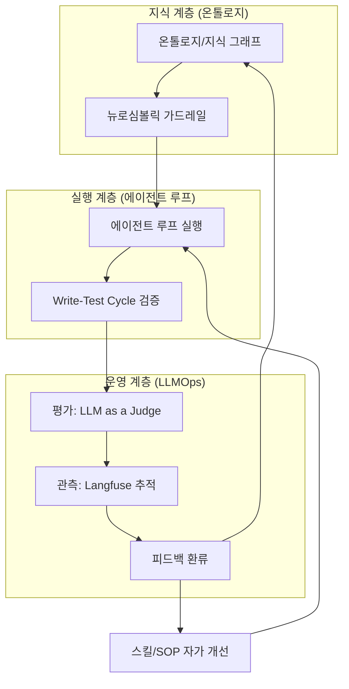
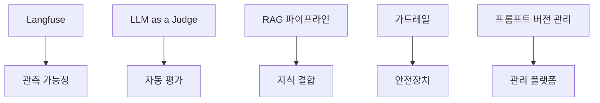

# 🏛️ 위키 지식 베이스 최종 통합 리포트
## 온톨로지 × LLMOps × 루프 엔지니어링: 지능형 AI 에이전트 시스템 완성

**작성일**: 2026-09-25  
**작성자**: Fortress AI Assistant  
**주제**: AI 에이전트의 지속적 자가 진화를 위한 통합 프레임워크  
**참조 자료**: 위키 내 온톨로지, LLMOps, 루프 엔지니어링 관련 모든 문서

---

## 📌 1. Executive Summary (집요요)

본 보고서는 위키 지식 베이스에 축적된 **세 가지 핵심 주제**(온톨로지, LLMOps, 루프 엔지니어링) 를 하나의 통합 프레임워크로 종합한 것입니다. 이 세 주제는 개별적으로 분리될 수 없으며, **하나의 지능형 AI 에이전트 시스템**을 구성하는 필수적인 세 축을 이룹니다:

| 축 | 역할 | 핵심 질문 |
|----|------|-----------|
| **온톨로지 (Ontology)** | 지식의 의미 구조화 | "지식을 어떻게 구조화하고 추론하는가?" |
| **LLMOps** | 운영·관측·평가 | "LLM 시스템을 어떻게 안정적으로 운영하고 평가하는가?" |
| **루프 엔지니어링 (Loop Engineering)** | 지속적 자가 진화 | "에이전트가 어떻게 스스로 개선되는가?" |

> **"온톨로지가 지식의 뼈대를, LLMOps 가 운영의 근육을, 루프 엔지니어링 이 진화의 신경계를 담당한다. 셋이 하나로 결합할 때 비로소 '자라는' 지능형 AI 에이전트가 완성된다."**

---

## 🎯 2. 온톨로지 (Ontology) — 지식의 구조화

### 2.1 온톨로지의 정의
> **온톨로지**: 실세계의 개념·관계·규칙을 컴퓨터가 논리적으로 이해·추론할 수 있도록 정의한 **지식 명세서 **(Knowledge Specification). W3C 표준 (RDF, OWL) 을 준수하며 자동 추론 (Reasoning) 기능을 내장합니다.

### 2.2 시맨틱 웹 기술 스택

| 기술 | 역할 | 특징 |
|------|------|------|
| **RDF** | 데이터 교환 규격 | 주어-서술어-목적어 트리플 구조 |
| **RDFS** | RDF 확장 명세 | 클래스/프로퍼티 계층구조 정의 |
| **OWL** | 온톨로지 정의 규격 | 논리 제약(대칭성·배타성), 자동 추론 |
| **추론기** | Pellet, HermiT 등 | OWL 규칙 기반 추론 수행 |

### 2.3 그래프 DB와의 관계

- **Neo4j**: 온톨로지 스키마를 담는 '그릇' 역할
  - `neosemantics(n10s)` 플러그인으로 OWL/RDF 스키마 적재
  - 다단계 탐색 쿼리 수행에 적합
- **GraphRAG**: 그래프 DB·온톨로지를 활용한 RAG 아키텍처
  - 엔티티 링킹 및 그래프 순회로 답변 정확도 향상
- **Text2Cypher**: 자연어 질문을 Cypher 쿼리로 변환, 자가 교정 루프

### 2.4 경량 온톨로지 (Soft Ontology) — llm-wiki

> **"llm-wiki 의 기본 방식은 LLM 이라는 강력한 자연어 추론 엔진을 전제로 설계된, 인간 친화적이고 유연한 경량 온톨로지입니다."**

| 구분 | 전통적 온톨로지 | 경량 온톨로지 (llm-wiki) |
|------|----------------|---------------------------|
| 포맷 | 기계 중심 (RDF/OWL) | 인간·LLM 가독성 중심 (마크다운) |
| 추론 | 형식 추론 엔진 | LLM 자연어 추론 |
| 유연성 | 엄격한 제약 | 유연한 의미 추론 |
| 구성 | 트리플·스키마 | 폴더 구조 + 위키링크 |

### 2.5 온톨로지와 뉴로심볼릭 AI

**뉴로심볼릭 AI**: 딥러닝(확률적 신경망)과 온톨로지·규칙 기반 추론(기호적 AI)을 융합하는 패러다임입니다. LLM 을 내부에 두고 외부의 온톨로지 지식 그래프 및 제약 조건 엔진으로 루프를 감싸 안아, 에이전트 시스템에 **논리적 안전장치 **(Guardrails) 를 부여합니다.

> **핵심 가치**: AI 에이전트 루프의 오작동·드리프트를 방지하고 논리적 안전장치를 세우기 위한 형식 온톨로지 (Formal Ontology) 통합.

---

## 🛠️ 3. LLMOps — 운영·관측·평가

### 3.1 MLOps 와 LLMOps 의 차이

> MLOps 는 고정된 정확도/손실 지표로 수치 모델을 안정화하는 반면, **LLMOps 는 LLM 특유의 비결정성 **(Non-determinism)과 환각 (Hallucination) 을 제어하고 가드레일·프롬프트·RAG·토큰 비용을 관할하는 운영 방법론입니다.

### 3.2 LLMOps 6 대 신규 운영 영역

| 영역 | 내용 |
|------|------|
| **가드레일** | 출력 제약·안전장치 관리 |
| **프롬프트 관리** | 버전 관리·변경 추적 |
| **RAG** | 외부 지식 결합 및 최적화 |
| **토큰 비용** | 비용 최적화 및 모니터링 |
| **관측 가능성** | 실행 추적·가시화 (Langfuse) |
| **평가** | LLM as a Judge 자동 채점 |

### 3.3 관측 가능성 (Observability)

- **Langfuse** (오픈소스 플랫폼): 프롬프트 버전 관리, 실행 추적 (Tracing), 토큰/비용 측정, LLM as a Judge 자동 평가 연동
- **LLMObservability**: LLM 애플리케이션의 블랙박스를 가시화

### 3.4 평가 체계 (LLM as a Judge)

| 지표 | 설명 | 측정 방법 |
|------|------|-----------|
| **정답성 **(Faithfulness) | 제공된 정보와 일치하는지 | LLM as a Judge 자동 채점 |
| **관련성 **(Relevance) | 질문과 직접 관련 있는지 | 정량적 분석 |
| **환각 여부** | 사실과 다른 정보 포함 여부 | Truthfulness 검증 |
| **토큰 효율성** | 불필요한 반복·사고 방지 | 토큰 사용량 모니터링 |

### 3.5 RAG 와 Fine-Tuning

- **RAG**: LLM 파라미터 지식 한계를 외부 지식 결합으로 보완
  - 한계: 청킹·임베딩·벡터 유사도 손실 → Agentic RAG 로 진화
- **Fine-Tuning **(SFT + LoRA): 손실 감소 곡선, 에폭, 과적합 예방 관리
- **합성 데이터 **(Synthetic Data): 개인정보 보호, 교사-학생 증류

---

## 🔄 4. 루프 엔지니어링 (Loop Engineering) — 지속적 자가 진화

### 4.1 순환 구조

```
실행 → 평가 (Evaluation) → 피드백 획득 → 자가 스킬 수정
   ↑                                          ↓
   └────────────── 지속적 진화 루프 ──────────┘
```

### 4.2 Write-Test Cycle (Red-Green-Refactor)

1. **Red 단계**: 실패하는 테스트 먼저 작성 — "강제적 기능 계약서" 역할
2. **Green 단계**: 최소 구현으로 테스트 통과
3. **Refactor 단계**: 코드 리팩토링 및 커밋

> **"에이전트가 '코드가 눈으로 보기에 완벽하니 테스트 없이 넘어가도 된다'고 제안하면 즉시 거부하고, 항상 도구를 직접 실행해 검증받아야 합니다."**

#### 보조 전략
- **headless / tmux execution**: CLI 도구나 인프라 작업을 에이전트가 제어 가상 터미널에서 실행
- **Accessibility Tree 기반 UI 테스트**: Web 앱 테스트 시 좌표 기반 스크린샷 대신 접근성 트리 ref 를 활용한 Playwright 검증

### 4.3 PLAN.md 승인 절차

에이전트에게 막연히 "구현해줘"라고 요청하면 시야 협착 (Tunnel Vision) 과 무한 디버깅 루프에 빠지기 쉽습니다. 따라서 4 단계 프로세스를 따릅니다:

```
1. 선행 탐색 (RESEARCH.md) →
2. PLAN.md 초안 작성 →
3. 사용자 검토/승인 →
4. 체크리스트 기반 순차 구현
```

### 4.4 학습 루프 (Learning Loop)

`learning.md` 파일을 통해:
1. **에이전트 실행**: 사용자 요청에 따라 작업 수행
2. **오작동 수집**: `learning.md` 에 실패 사례 기록
3. **랩업 단계**: 개발 프로세스 마무리 시 검토
4. **SOP 업데이트**: 메인 스킬 매뉴얼 자동 교정
5. **자가 진화**: 에이전트 성능 지속적 개선

> 이를 통해 에이전트는 동일한 실수를 장기적으로 반복하지 않고 자율적으로 진화할 수 있게 됩니다.

### 4.5 바이브 코딩 (Vibe Coding) 패러다임

Andrej Karpathy 가 대중화한 개념으로, "**AI 에이전트에게 자연어로 목표·문맥을 제시하고, 생성·실행·검증 루프를 감독하며 흐름을 이끄는**"방식입니다. 라인 단위 정밀 이해, 자가 반성 루프 (Self-reflection), 인터랙티브 PR 리뷰, 도메인 지식 수반을 요구합니다.

---

## 🔗 5. 세 축의 통합 (Integration)

### 5.1 통합 아키텍처



### 5.2 통합 시나리오

1. **지식 구조화 **(온톨로지): 도메인 지식을 온톨로지/지식 그래프로 구조화하여 뉴로심볼릭 가드레일로 에이전트 루프를 감싼다.
2. **안정적 실행 **(루프 엔지니어링): Write-Test Cycle 과 PLAN.md 승인 절차로 오작동·드리프트를 통제한다.
3. **운영·평가 **(LLMOps): Langfuse 로 관측하고, LLM as a Judge 로 평가하며, 실패 사례를 피드백으로 환류한다.
4. **지속적 진화 **(루프): 피드백이 스킬/SOP 와 온톨로지에 반영되어 에이전트가 스스로 진화한다.

---

## ⚠️ 6. 공통 Gotchas 및 주의사항

| 구분 | 주의사항 |
|------|----------|
| **루프** | 무한 루프 방지 (`disable_model_invocation`), `MAX_THINKING_TOKENS` 제한 |
| **비용** | 서브 에이전트 경량화, 토큰 비용 모니터링 |
| **검증** | "눈으로 완벽" 주장 불가 — 도구 실행으로 반드시 검증 |
| **온톨로지** | 과도한 형식 논리보다 LLM 유연 추론 활용 (경량 온톨로지) |
| **평가** | 자동 평가만으로는 편향 누락 — 인간-in-the-loop 필수 |

---

## 📊 7. 기술 스택 비교 분석

### 7.1 그래프 DB vs 온톨로지 vs GraphRAG

| 기술 | 역할 | 특징 |
|------|------|------|
| **온톨로지** | 지식의 "헌법" | 의미 + 논리 규칙 + 자동 추론 |
| **그래프 DB** | 데이터 저장용 "그릇" | Neo4j 등 LPG 기반, 초고속 조회 |
| **GraphRAG** | AI 답변 고도화 "기술" | 구조화된 지식 그래프 검색 활용 |

### 7.2 LLMOps 기술 스택



---

## 📚 8. 위키 인덱스

### 8.1 온톨로지 관련 문서
- `concepts/Ontology.md` — 온톨로지 정의
- `concepts/OWL.md` · `concepts/RDF.md` · `concepts/RDFS.md` — 시맨틱 웹 스택
- `entities/Neo4j.md` — 그래프 DB
- `concepts/GraphRAG.md` · `concepts/Text2Cypher.md` — 그래프 활용
- `concepts/NeurosymbolicAI.md` — 뉴로심볼릭 융합
- `concepts/llm-wiki.md` — 경량 온톨로지
- `sources/llm-wiki-ontology-qa.md` · `sources/graphdb-ontology.md`

### 8.2 LLMOps 관련 문서
- `entities/LLMOps.md` — LLMOps 생태계
- `concepts/MLOpsVsLLMOps.md` — MLOps 대비
- `entities/Langfuse.md` — 관측 플랫폼
- `concepts/LLMObservability.md` — 관측 가능성
- `concepts/LLMasAJudge.md` — 평가 패턴

### 8.3 루프 엔지니어링 관련 문서
- `concepts/LoopEngineering.md` — 핵심 방법론
- `concepts/LearningLoop.md` — 자가 진화 루프
- `concepts/AgentLoop.md` — 튜링 완전성 기반 루프
- `concepts/WriteTestCycle.md` — TDD 검증
- `reports/loop-engineering-report.md` — 루프 엔지니어링 심화 리포트

---

## 💡 9. 결론 (Conclusion)

본 리포트는 위키 지식 베이스에 축적된 **온톨로지**, **LLMOps**, **루프 엔지니어링** 세 주제를 통합하여, 지능형 AI 에이전트 시스템의 완성을 위한 통합 프레임워크를 제시했습니다.

- **온톨로지**는 지식을 구조화하고 논리적 안전장치를 제공한다
- **LLMOps**는 LLM 특유의 비결정성을 통제하고 운영·평가 체계를 구축한다
- **루프 엔지니어링**은 실행→평가→피드백→개선의 순환을 통해 에이전트가 스스로 진화하게 한다

이 세 축이 유기적으로 결합할 때, 단순한 도구를 넘어 **자라는 생명체 같은 AI 시스템**이 완성됩니다. 🚀

---

## 📎 부록: 핵심 통찰 명언 모음

1. > **"온톨로지가 지식의 뼈대를, LLMOps 가 운영의 근육을, 루프 엔지니어링 이 진화의 신경계를 담당한다."**
2. > **"루프를 멈추지 않는 지능형 에이전트 아키텍처는 단순히 성능을 높이는 것이 아니라, '자란다는' 생명체 같은 AI 시스템을 만드는 것입니다."**
3. > **"에이전트가 '코드가 눈으로 보기에 완벽하니 테스트 없이 넘어가도 된다'고 제안하면 즉시 거부하고, 항상 도구를 직접 실행해 검증받아야 합니다."**

---

**최종 수정**: 2026-09-25  
**관련 리포트**: 
- `wiki/reports/loop-engineering-report.md` (루프 엔지니어링 심화)
- `wiki/reports/integrated-ontology-llmops-loop-report.md` (기존 통합 리포트)
