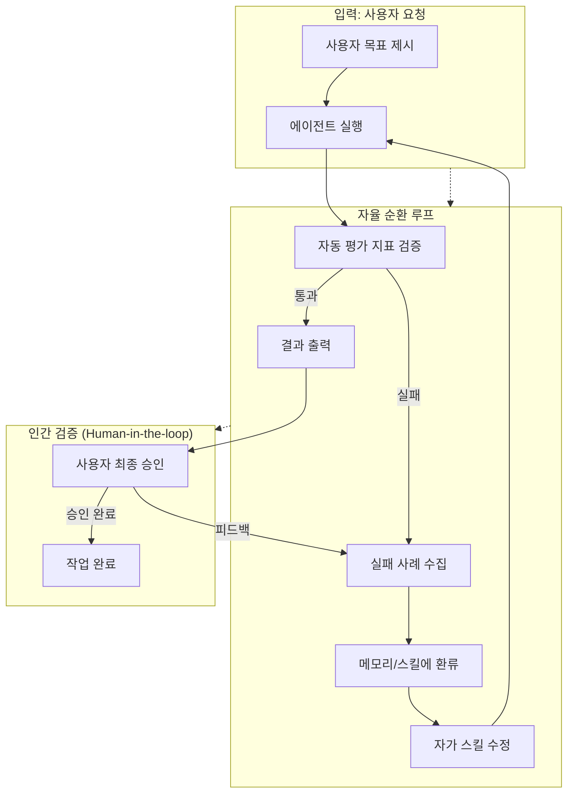

# 루프 엔지니어링 (Loop Engineering) 종합 보고서

**작성일**: 2026-09-25  
**작성자**: Fortress AI Assistant  
**주제**: AI 에이전트의 지속적 자가 진화를 위한 순환 루프 설계 및 운영 방법론  
**참조 자료**: 위키 내 LoopEngineering, LearningLoop, AgentLoop, WriteTestCycle 등 관련 문서

---

## 📌 1. 개요

### 정의
> **"루프 엔지니어링 (Loop Engineering)은 AI 에이전트 및 스킬이 일회성 명령으로 끝나는 것이 아니라, 실행 → 자동/인간 평가 → 피드백 환류 → 자가 지침 개선의 순환 루프(Loop)를 스스로 형성하여 지속적으로 성능이 진화하도록 설계하는 에이전틱 엔지니어링 방법론입니다."**

### 핵심 목표
- 에이전트 결과물의 품질을 **자동 평가 지표**로 검증
- 실패 사례를 **메모리/스킬**에 환류하여 지속적 개선
- "자란다는" 생명체 같은 AI 시스템 구축

---

## 🏗️ 2. 핵심 구성 요소 및 설계 원칙

### 5단계 설계 원칙 (Maker Evan의 방법론)

| 단계 | 내용 | 역할 |
|------|------|------|
| **1** | 정의 및 비전 수립 | 루프 엔지니어링 개념 정립, 목표 설정 |
| **2** | 자율 순환 루프 실행 | 에이전트 자가 평가 메커니즘 구축 |
| **3** | 인간 검증 (Human-in-the-loop) | 최종 승인 및 평가 지표 세팅 |
| **4** | 동향 분석 | 해외 최신 사례 연구, 벤치마킹 |
| **5** | 실무 적용 과제 | 즉각 적용 가능한 스킬 설계 예시 |

---

## 🔄 3. 자율 순환 루프 실행 메커니즘

### 3.1 Write-Test Cycle (Red-Green-Refactor)

```
→ Red 단계: 실패하는 테스트 먼저 작성 ← "강제적 기능 계약서"
   ↓
→ Green 단계: 최소 구현으로 테스트 통과
   ↓
→ Refactor 단계: 코드 리팩토링 및 커밋
```

#### 핵심 원칙
> **"에이전트가 '코드가 눈으로 보기에 완벽하니 테스트 없이 넘어가도 된다'고 제안하면 즉시 거부하고, 항상 도구를 직접 실행해 검증받아야 합니다."**

#### 보조 전략
- **headless / tmux execution**: CLI 도구를 에이전트가 제어 가상 터미널에서 실행
- **Accessibility Tree 기반 UI 테스트**: 좌표 스크린샷 대신 ref 활용하여 Playwright 검증

### 3.2 PLAN.md 승인 절차

```
1. 선행 탐색 (RESEARCH.md) →
2. PLAN.md 초안 작성 →
3. 사용자 검토/승인 →
4. 체크리스트 기반 순차 구현
```

#### 목적: 시야 협착(Tunnel Vision)과 무한 디버깅 루프 방지

### 3.3 바이브 코딩 (Vibe Coding) 패러다임

Andrej Karpathy가 대중화한 개념:
- "AI 에이전트에게 **자연어로 목표·문맥을 제시**하고, 생성·실행·검증 루프를 감독하며 흐름을 이끄는" 방식
- 라인 단위 정밀 이해, 자가 반성 루프(Self-reflection), 인터랙티브 PR 리뷰 요구

---

## 👤 4. 인간-in-the-loop 검증 및 평가 지표

### 4.1 평가 지표 체계

| 지표 | 설명 | 측정 방법 |
|------|------|-----------|
| **정답성 (Faithfulness)** | 제공된 정보와 일치하는지 | LLM as a Judge 자동 채점 |
| **관련성 (Relevance)** | 사용자 질문과 직접 관련 있는지 | 정량적 분석 |
| **환각 여부** | 사실과 다른 정보가 포함되었는지 | Truthfulness 검증 |
| **토큰 효율성** | 불필요한 반복 및 사고 방지 | 토큰 사용량 모니터링 |

### 4.2 LLM as a Judge 평가 패턴

고성능 프론티어 LLM(GPT-4 등)에게 평가 기준(Prompt/Rubric)을 부여하여, 타 LLM 모델이나 RAG 파이프라인의 생성 응답에 대해 자동으로 정량 채점합니다.

---

## 📊 5. 루프 엔지니어링 아키텍처 다이어그램



---

## 🧪 6. 실무 적용 예시

### 6.1 학습 루프 (Learning Loop)

`learning.md` 파일을 통해:
1. **에이전트 실행**: 사용자 요청에 따라 작업 수행
2. **오작동 수집**: `learning.md`에 실패 사례 기록
3. **랩업 단계**: 개발 프로세스 마무리 시 검토
4. **SOP 업데이트**: 메인 스킬 매뉴얼 자동 교정
5. **자가 진화**: 에이전트 성능 지속적 개선

> 이를 통해 에이전트는 동일한 실수를 장기적으로 반복하지 않고 자율적으로 진화할 수 있게 됩니다.

### 6.2 Claude Code 표준 워크플로우 (8단계)

1. 분석 지시 →
2. PLAN.md 계획 →
3. 명시적 승인 전 구현 금지 →
4. 단계별 체크 →
5. 타입 안전성 →
6. 작성-실행-검증 루프 →
7. 실패 시 커밋 복구 →
8. 작업 후 리뷰 인터뷰

---

## 📈 7. 에이전트 루프의 진화 (Evolution of Agent Loops)

### 진화 단계
1. 고정된 순서 단방향 워크플로우
2. 실시간 피드백 수용 '에이전트 루프'
3. 멀티 에이전트 역할 분담
4. 그래프 엔지니어링 및 지식 그래프 연동
5. 상위 레벨 지식 전달 (현재)

> **"Anthropic 팀은 AI 에이전트 구축의 핵심으로 '유연한 에이전트 루프'와 '다중 에이전트를 통한 역할 분담'을 꼽았습니다."**

### 에이전트 루프의 본질과 한계

- **본질**: '감지(Perceive) → 계획/결정(Plan/Decide) → 도구 실행(Act)' 단계 반복
- **한계**: 무한 루프, 대화의 변질(Drift), 토큰 비용 폭발 등의 위험
- **해법**: Pydantic과 온톨로지 활용하여 뉴로심볼릭 구조화

---

## 🔍 8. Gotchas 및 주의사항

| 주의사항 | 내용 |
|----------|------|
| **무한 루프 방지** | 모델 호출 비활성화(`disable_model_invocation`)로 제어 |
| **토큰 비용 최적화** | `MAX_THINKING_TOKENS`를 4,000 수준으로 제한 |
| **서브 에이전트 경량화** | `CLAUDE_CODE_SUBAGENT_MODEL`로 비용 절감 |
| **강제 검증 원칙** | "눈으로 완벽해 보인다"는 주장만으로는 통과 불가 — 도구 실행으로 반드시 검증 |

---

## 📚 9. 관련 위키 링크

| 개념 | 파일 경로 | 설명 |
|------|-----------|------|
| LoopEngineering | `wiki/concepts/LoopEngineering.md` | AI 에이전트 자율 진화 방법론 |
| LearningLoop | `wiki/concepts/LearningLoop.md` | 자가 진화 루프 설계 |
| AgentLoop | `wiki/concepts/AgentLoop.md` | 튜링 완전성 기반 에이전트 루프 |
| WriteTestCycle | `wiki/concepts/WriteTestCycle.md` | TDD 기반 Red-Green-Refactor 검증 |
| NeurosymbolicAI | `wiki/concepts/NeurosymbolicAI.md` | 온톨로지·규칙 기반 뉴로심볼릭 구조화 |
| LLMasAJudge | `wiki/concepts/LLMasAJudge.md` | 평가 패턴 (자동 채점) |
| LLMObservability | `wiki/concepts/LLMObservability.md` | 관측 가능성 (블랙박스 가시화) |

---

## 💡 10. 핵심 통찰 및 요약

### 핵심 통찰
> **"루프를 멈추지 않는 지능형 에이전트 아키텍처는 단순히 성능을 높이는 것이 아니라, '자란다는' 생명체 같은 AI 시스템을 만드는 것입니다."**

### 세 가지 핵심 기둥
1. **Write-Test Cycle** (TDD 기반 Red-Green-Refactor) — 강제적 검증 장치
2. **PLAN.md 승인 절차** — 시야 협착과 무한 디버깅 방지
3. **인간-in-the-loop** — 최종 품질 보장

### 실무 적용 체크리스트
- [ ] 자동 평가 지표 체계 구축 완료
- [ ] 실패 사례 메모리/스킬 환류 시스템 마련
- [ ] 인간-in-the-loop 최종 검증 절차 수립
- [ ] PLAN.md 승인 절차 도입
- [ ] Write-Test Cycle 강제 검증 루프 구현
- [ ] 무한 루프/토큰 비용 제어 장치 적용

---

## 📝 결론

루프 엔지니어링은 AI 에이전트의 **자가 진화**를 가능하게 하는 핵심 방법론입니다. 실행 → 평가 → 피드백 → 개선의 순환 구조를 통해, 에이전트가 동일한 실수를 반복하지 않고 장기적으로 성능을 향상시킵니다.

이 방법론을 적용함으로써 개발자는 "자란다는" 진정한 지능형 AI 에이전트를 구축할 수 있습니다. 🚀

---

**최종 수정**: 2026-09-25  
**참조 자료**: youtube-summary-GlR5I1wFWpM, writing-skill-guide, hellollama-plan-tdd-lecture 등
